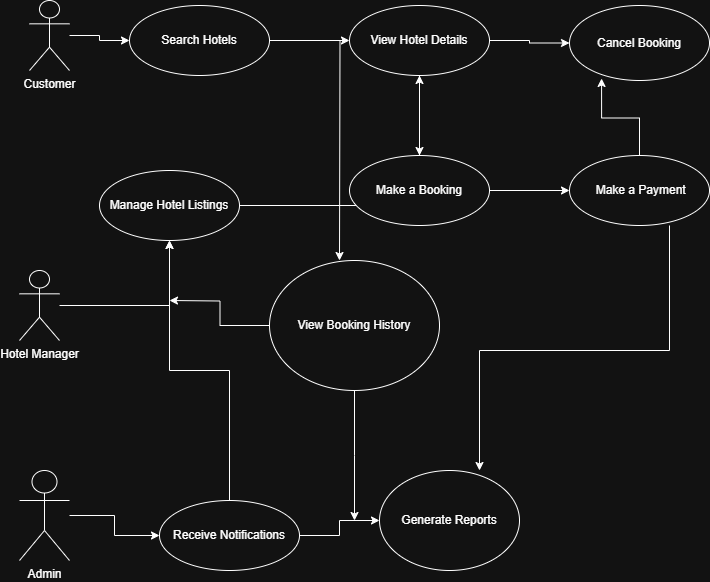

#   Requirement-analysis
## Requirement Analysis in Software Development.
The Requirement Analysis Project focuses on crafting a comprehensive foundation for software development by documenting, analyzing, and structuring requirements.

## What is Requirement Analysis?
### Requirement Analysis is a critical phase in the software development lifecycle (SDLC) where the project team gathers, analyzes, and defines the requirements of the software product to be developed. This process ensures that all stakeholders have a clear and mutual understanding of what the system should do and how it should perform.

### Why is Requirement Analysis Important?
1. Clarity and Understanding: It helps in understanding what the stakeholders expect from the software, reducing ambiguity.
2. Scope Definition: Clearly defines the scope of the project, which helps in preventing scope creep.
3. Basis for Design and Development: Provides a solid foundation for designing and developing the system.

### Key Activities in Requirement Analysis.
**1. Requirement Gathering**🗂️

- Interviews: Conducting interviews with stakeholders to gather detailed information about their needs and expectations.
Surveys/Questionnaires: Distributing surveys to collect requirements from a larger audience.

- Observation: Observing end-users in their working environment to understand their needs.

- Document Analysis: Reviewing existing documentation and systems to understand current functionalities and requirements.

**2. Requirement Elicitation**

- Brainstorming: Conducting brainstorming sessions to generate ideas and gather requirements.
Focus .

- Groups: Holding focus group discussions with selected stakeholders to gather detailed requirements.

- Prototyping: Creating prototypes to help stakeholders visualize the system and refine their requirements.

**3. Requirement Documentation**

- Requirement Specification Document: Creating a detailed document that lists all functional and non-functional requirements.

- User Stories: Writing user stories to describe functionalities from the user’s perspective.

- Use Cases: Creating use case diagrams to show interactions between users and the system.

**4. Requirement Analysis and Modeling**
- Requirement Prioritization: Prioritizing requirements based on their importance and impact on the project.

- Feasibility Analysis: Assessing the feasibility of requirements in terms of technical, financial, and time constraints.

- Modeling: Creating models (e.g., data flow diagrams, entity-relationship diagrams) to visualize and analyze requirements.

**5. Requirement Validation.**

- Review and Approval: Reviewing the documented requirements with stakeholders to ensure accuracy and completeness.

- Acceptance Criteria: Defining clear acceptance criteria for each requirement to ensure they meet the expected standards.

- Traceability: Establishing traceability matrices to ensure all requirements are addressed during development and testing.

## Types of Requirements

In any large-scale application like a booking managenent platform, understanding both **Functional** and **Non-functional** requirements is critical to building a system that not only works correctly but also performs efficiently under heavy user load.

### Functional Requirements

Functional requirements define **what the system should do**. They are specific behaviors, functions, and operations that the system must support.

Examples for the Hotel Booking System:
- Users can **search for hotels** by location, dates, and price range.
- Customers can **book a hotel room** and complete payments using integrated payment gateways.
- Hotel managers can **create, update, and manage hotel listings** via a separate management portal.
- Users can **view their current and past bookings** through the View Booking Service.
- Notification services should send **booking confirmations and promotional alerts** to customers and managers.
- Booking service should **check room availability** and **update booking status** in real-time.

### Non-functional Requirements

Non-functional requirements define **how the system performs** a function rather than what it does. These focus on system quality, performance, scalability, and reliability.

Examples for the Hotel Booking System:
- The system must **handle high concurrent user traffic** (millions of users globally) with minimal latency.
- **ElasticSearch** should return hotel search results in under 500 milliseconds.
- **CDN integration** should ensure fast loading of hotel images and content across different regions.
- The system must be **highly available and fault-tolerant**, with **load balancing** and **master-slave DB replication**.
- Booking and customer services should have **response times under 1 second** on 90% of requests.
- The system must support **horizontal scalability** via microservices for search, booking, and management features.
- Data should be **archived efficiently** in Cassandra for long-term access without impacting live database performance.
- The platform should follow **security best practices** in API access and payment integration.

---
## Use Case Diagrams

**Use Case Diagrams** are a type of behavioral diagram defined by UML (Unified Modeling Language). They help visualize the interactions between users (actors) and the system, and they outline the system’s functional requirements from the end-user perspective.

### 🔍 Why Use Case Diagrams?

- Clarify system functionality and interactions.
- Identify external and internal actors involved.
- Aid in validating functional requirements.
- Serve as communication tools among stakeholders and developers.

---

### 🧩 Use Case Diagram for Hotel Booking System

Below is the use case diagram for a simplified hotel booking platform. It illustrates the key actors and their interactions with major system features.

**Actors:**
- Customer
- Hotel Manager
- Admin

**Use Cases:**
- Search Hotels
- View Hotel Details
- Make a Booking
- Make a Payment
- Cancel Booking
- Manage Hotel Listings
- View Booking History
- Receive Notifications
- Generate Reports (Admin)

---

## 📋 Acceptance Criteria

### What is Acceptance Criteria?

**Acceptance Criteria** are specific conditions or requirements that a software product must meet to be accepted by a user, customer, or other stakeholders. It is used in **Requirement Analysis** to clearly define what "done" means for a feature or user story. These criteria help ensure that all stakeholders have a shared understanding of functionality and help developers and testers know what to implement and verify.

---

### ✅ Why It Matters

- ✅ Defines the boundaries of a user story or feature  
- ✅ Ensures consistent understanding between developers, testers, and stakeholders  
- ✅ Provides a basis for test cases and user acceptance testing  
- ✅ Reduces ambiguity and scope creep during development

---

### 🛒 Example: Acceptance Criteria for **Checkout Feature**

**User Story:**  
_As a user, I want to securely checkout after selecting a hotel and preferred dates, so that I can complete my booking with a payment._

#### ✔️ Acceptance Criteria:

1. The checkout page should display selected hotel details, check-in and check-out dates, and total price.
2. User must be able to enter payment information (credit card, mobile money, etc.).
3. Payment should be processed via an integrated third-party payment gateway (e.g., Paystack, Stripe).
4. Upon successful payment, user should receive a confirmation message with booking ID and details.
5. An email notification with booking receipt must be sent to the user immediately after payment.
6. If payment fails, the user must be shown an appropriate error message and allowed to retry.

